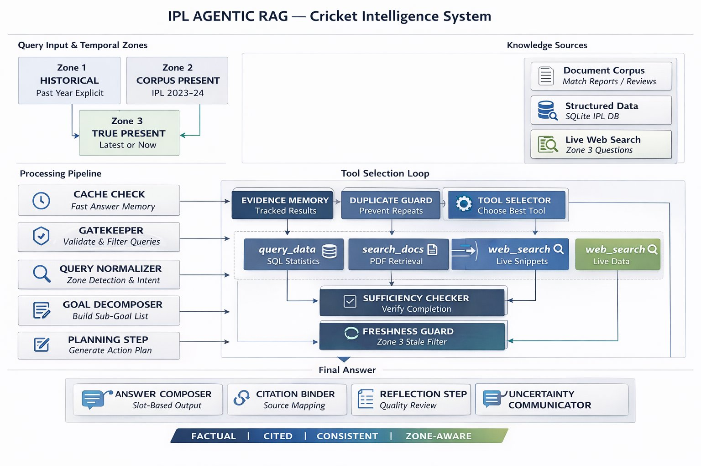
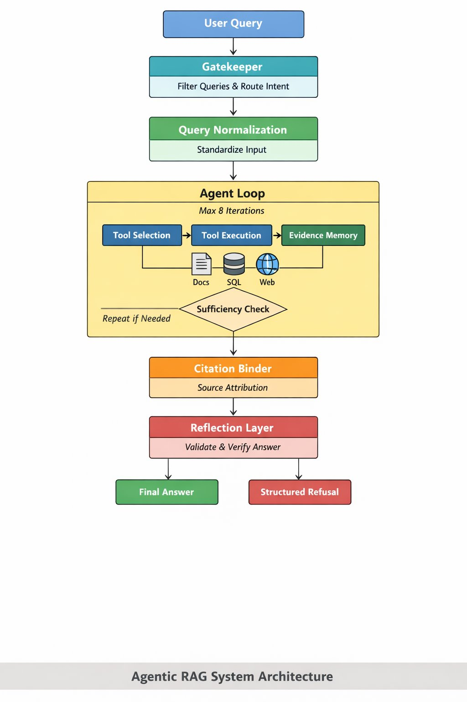

<div align="center">


# 🏏 IPL Agentic RAG
### Cricket Intelligence System — Agentic RAG over Structured + Unstructured + Live Data

<br/>

[](https://python.org)
[](https://console.groq.com)
[](https://faiss.ai)
[](https://sqlite.org)
[](https://tavily.com)
[](LICENSE)
[](https://github.com/Santhosh-2226/AGENTIC-RAG-PRODAPT)

<br/>

> **An LLM agent that answers IPL cricket questions over three mixed data sources —
> structured statistics, unstructured documents, and live web — with grounded answers,
> exact citations, and graceful failure. No LangChain. No framework. Every line explainable.**

<br/>

[🚀 Quick Start](#-setup) · [🏗️ Architecture](#-architecture) · [🔧 Tools](#-the-three-tools) · [📊 Examples](#-example-outputs) · [🧪 Evaluation](#-evaluation-summary) · [❌ Failures](#-known-failure-modes)

<br/>

---

</div>

## 📌 What This Is

Built for the **CIT Agentic RAG Internship Assignment — Option B (Sports Season Data)**.
Corpus: **IPL 2022 and IPL 2023**.

> **AI disclosure:** Claude (Anthropic) was used as a coding assistant. All architecture decisions, tool contracts, and agent loop design are my own.

**Repository:** https://github.com/Santhosh-2226/AGENTIC-RAG-PRODAPT

---

## 🎯 Core Principle

```
Don't generate answers. Retrieve → Reason → Compose.
```

Every single claim in every answer is bound to an **exact, verifiable source**:

| Claim Type | Source Binding |
|---|---|
| 📊 Statistical | SQLite table name + row count |
| 📄 Document | PDF filename + page number + season tag |
| 🌐 Live/Current | URL + publication date |

> If evidence is missing, the agent says so. **It never hallucinates.**

---
## 🏗️ Architecture

> 📘 **Full Engineering Design Document:**  
> [Open IPL Agentic RAG Design Document](https://drive.google.com/file/d/13ALEGcQS9DOp2JFdKz0YNv8AqXTCeSox/view?usp=sharing)

> 🎥 **Demo Video:**  
> [Watch Project Demo](https://drive.google.com/file/d/1-s-X8bRYF3oXA2YJ56Ak8yrPO687tqhn/view?usp=drive_link)

### High-Level System Overview

> Two views of the same system — a detailed pipeline view and a simplified agent loop view.

<br/>

**Full Pipeline Architecture** — 12-layer end-to-end flow with zone routing, tool selection, and post-processing:

[](docs/IPL_Agentic_RAG_Design_Document.pdf)

<br/>

**Simplified Agent Loop** — Core decision cycle from query to final answer:

[](docs/IPL_Agentic_RAG_Design_Document.pdf)

### Full 12-Layer Pipeline

```
┌─────────────────────────────────────────────────────────────────┐
│                        USER QUESTION                            │
└──────────────────────────────┬──────────────────────────────────┘
                               │
                               ▼
┌─────────────────────────────────────────────────────────────────┐
│  LAYER 1 — CACHE CHECK                                          │
│  diskcache · zone-aware TTL (Z1=∞, Z2=24h, Z3=1h)             │
│  HIT → return instantly, zero API cost                          │
└──────────────────────────────┬──────────────────────────────────┘
                               │ MISS
                               ▼
┌─────────────────────────────────────────────────────────────────┐
│  LAYER 2 — GATEKEEPER                                           │
│  ├── Trivial → direct answer ("what is 2+2")                    │
│  ├── Refuse  → betting / investment / prediction questions       │
│  └── Out of scope → year not in corpus (only 2022, 2023)        │
└──────────────────────────────┬──────────────────────────────────┘
                               │ PROCEED
                               ▼
┌─────────────────────────────────────────────────────────────────┐
│  LAYER 3 — QUERY NORMALISER                                     │
│  ├── Entity resolution: "kohli" → "Virat Kohli"                 │
│  │                      "mi"    → "Mumbai Indians"               │
│  ├── Zone detection:                                             │
│  │   Zone 1 — explicit past year (2022/2023)                    │
│  │   Zone 2 — corpus-present (default)                          │
│  │   Zone 3 — "now/currently/today/latest/still/current"        │
│  ├── Intent: statistical / narrative / causal / comparative      │
│  ├── Compound split: "runs AND analyst opinion" → 2 sub-Qs      │
│  └── Scope trap: "everything about IPL 2023" → ask to narrow    │
└──────────────────────────────┬──────────────────────────────────┘
                               │
                               ▼
┌─────────────────────────────────────────────────────────────────┐
│  LAYER 4 — GOAL DECOMPOSER                                      │
│  ├── One sub-goal per question component                         │
│  ├── Comparative → one sub-goal per entity                       │
│  ├── Each sub-goal: tool_type · entity · zone · OPEN/CLOSED     │
│  └── Sufficiency checker won't pass until all are CLOSED        │
└──────────────────────────────┬──────────────────────────────────┘
                               │
                               ▼
┌─────────────────────────────────────────────────────────────────┐
│  LAYER 5 — PLANNING STEP  [Bonus A]                             │
│  Agent writes 1-3 sentence plan BEFORE any tool call            │
│  Stored in trace. Shows reasoning, not just outputs.            │
└──────────────────────────────┬──────────────────────────────────┘
                               │
                               ▼
┌─────────────────────────────────────────────────────────────────┐
│  LAYER 6 — AGENT LOOP  (hard cap: 8 tool calls)                 │
│                                                                  │
│  ┌─────────────────────────────────────────────────────────┐   │
│  │  SMART TOOL ROUTER (_pick_best_tool)                    │   │
│  │  Priority 1: Zone 3 + web not called → web_search      │   │
│  │  Priority 2: Statistical type → query_data first        │   │
│  │  Priority 3: query_data 0 rows → search_docs fallback   │   │
│  │  Priority 4: Narrative intent → search_docs first       │   │
│  │  Priority 5: Comparative → query_data (1 SQL)           │   │
│  │  Default: query_data                                    │   │
│  └──────────────────────────┬──────────────────────────────┘   │
│                             │                                    │
│  ┌──────────────────────────▼──────────────────────────────┐   │
│  │  DUPLICATE GUARD                                        │   │
│  │  hash = MD5(tool_name + json(inputs))                   │   │
│  │  Already called? → block, warn LLM, continue            │   │
│  └──────────────────────────┬──────────────────────────────┘   │
│                             │                                    │
│  ┌──────────────────────────▼──────────────────────────────┐   │
│  │  ZONE GUARD (Zone 3 enforcement)                        │   │
│  │  zone==3 AND web not called AND tool != web_search      │   │
│  │  → block corpus tools until web_search fires first      │   │
│  └──────────────────────────┬──────────────────────────────┘   │
│                             │                                    │
│  ┌──────────────────────────▼──────────────────────────────┐   │
│  │  TOOL EXECUTION  (retry once on failure)                │   │
│  │  ┌────────────┐  ┌─────────────┐  ┌──────────────┐    │   │
│  │  │ query_data │  │ search_docs │  │  web_search  │    │   │
│  │  │  SQLite    │  │  FAISS+BM25 │  │  Tavily API  │    │   │
│  │  │  ~22ms     │  │  ~156ms     │  │  ~1842ms     │    │   │
│  │  └────────────┘  └─────────────┘  └──────────────┘    │   │
│  └──────────────────────────┬──────────────────────────────┘   │
│                             │                                    │
│  ┌──────────────────────────▼──────────────────────────────┐   │
│  │  SUFFICIENCY CHECKER                                    │   │
│  │  All sub-goals CLOSED?  → exit loop                    │   │
│  │  Zone 3 + web result?   → required before exit         │   │
│  │  tool_calls >= 8?       → hard cap → structured refusal│   │
│  └──────────────────────────┬──────────────────────────────┘   │
│                             │ not sufficient → loop back         │
└─────────────────────────────┴──────────────────────────────────┘
                               │
                               ▼
┌─────────────────────────────────────────────────────────────────┐
│  LAYER 7 — ANSWER COMPOSER  (slot-based)                        │
│  Statistical slot ← query_data results only                     │
│  Narrative slot   ← search_docs results only                    │
│  Current slot     ← web_search results only                     │
│  LLM synthesises across populated slots only                    │
│  Never fills from training data                                 │
└──────────────────────────────┬──────────────────────────────────┘
                               ▼
┌─────────────────────────────────────────────────────────────────┐
│  LAYER 8 — CITATION BINDER                                      │
│  Statistical claim → table + row count                          │
│  Document claim   → filename + page number + season             │
│  Web claim        → URL + publication date                      │
│  No LLM-generated citations — only what was retrieved           │
└──────────────────────────────┬──────────────────────────────────┘
                               ▼
┌─────────────────────────────────────────────────────────────────┐
│  LAYER 9 — REFLECTION  [Bonus C]                                │
│  Checks: answers question? every claim cited?                   │
│  contradictions? zone consistent?                               │
│  FAIL + steps remaining → one more targeted retrieval           │
└──────────────────────────────┬──────────────────────────────────┘
                               ▼
┌─────────────────────────────────────────────────────────────────┐
│  LAYER 10 — UNCERTAINTY COMMUNICATOR                            │
│  Source count · staleness flag · unresolved gaps                │
└──────────────────────────────┬──────────────────────────────────┘
                               ▼
┌─────────────────────────────────────────────────────────────────┐
│  LAYER 11 — TRACE WRITER  [Bonus B telemetry]                   │
│  JSON trace: question · plan · steps · answer · citations       │
│  Latency + call count + failures per tool per run               │
└──────────────────────────────┬──────────────────────────────────┘
                               ▼
┌─────────────────────────────────────────────────────────────────┐
│  LAYER 12 — CACHE STORE                                         │
│  Zone-aware TTL: Z1=forever · Z2=24h · Z3=1h                   │
└──────────────────────────────┬──────────────────────────────────┘
                               ▼
                    ┌─────────────────────┐
                    │    FINAL ANSWER     │
                    │  + CITATIONS        │
                    │  + UNCERTAINTY      │
                    │  + TRACE PATH       │
                    └─────────────────────┘
```

---

### Three Temporal Zones

```
EVERY QUESTION IS CLASSIFIED HERE BEFORE ANY TOOL IS SELECTED.
This is a hard rule — the sufficiency checker cannot override it.

  Question received
       │
       ├── Contains "now" / "currently" / "today" / "latest"
       │   "still" / "current" / "right now" ──────────────► ZONE 3 🌐
       │                                                       web_search MANDATORY first
       │
       ├── Contains explicit year "2022" or "2023" ──────────► ZONE 1/2 📚
       │                                                        corpus tools, web never
       │
       └── No temporal signal ─────────────────────────────► ZONE 2 (default) 📚
                                                              corpus tools first
```

### Smart Tool Router Decision Tree

```
Question arrives at _pick_best_tool()
         │
         ├── Zone 3 AND web not yet called ───────────────────► web_search 🌐
         │
         ├── classify_question() != "unknown"
         │   AND query_data not yet called ──────────────────► query_data 🗃️
         │
         ├── query_data called AND returned 0 rows
         │   AND search_docs not yet called ─────────────────► search_docs 📄 (fallback)
         │
         ├── query_data 0 rows AND both corpus exhausted ─────► web_search 🌐 (last resort)
         │
         ├── Narrative/causal intent
         │   AND search_docs not yet called ─────────────────► search_docs 📄
         │
         ├── Comparative AND query_data not called ──────────► query_data 🗃️
         │                                                       (single SQL covers both)
         │
         └── Default ──────────────────────────────────────► query_data 🗃️
```

### LLM Model Ladder (Failure Recovery)

```
Attempt 1 ─── llama-3.3-70b-versatile + tools
     │
     │  tool_use_failed (400 error)?
     ▼
Attempt 2 ─── llama-4-scout-17b + tools
     │
     │  tool_use_failed again?
     ▼
Attempt 3 ─── llama-3.1-8b-instant + tools
     │
     │  LLM still skips tools?
     ▼
Force Router ── _pick_best_tool() bypasses LLM entirely
               Calls tool directly using question classifier
               No hardcoded answers — routes by question type only
```

### Infinite Loop Prevention

```
Three independent mechanisms — ALL must be bypassed to loop:

  1. HARD CAP ──────────── tool_calls >= 8 → break unconditionally
  2. DUPLICATE GUARD ────── hash(tool_name + inputs) in memory → block
  3. WEB CAP ───────────── web_calls >= 2 → block web_search

  If cap fires with open goals → structured refusal:
  "Searched 8 times. Could not resolve: [goal]. Outside corpus."
```

---

## 🔧 The Three Tools

### `query_data` — Structured Statistics 🗃️

| Field | Value |
|---|---|
| **Purpose** | Precise numerical statistics from SQLite |
| **Use for** | Runs, wickets, averages, match results, rankings |
| **Avoid for** | Opinions, analysis, live info |
| **Input** | `question: str`, `table_hint: str (optional)` |
| **Output** | `{success, sql, columns, rows, row_count, source_table}` |
| **Latency** | ~22ms (local SQLite) |
| **Cost** | Zero |

**Internal mechanics:** Rule-based NL → SQL classifier (`classify_question()`) maps 10+ question patterns to SQL templates. **No LLM in SQL generation — zero hallucination risk.** `SELECT` only — no writes possible.

**Database schema:**
```sql
-- 179,372 rows
deliveries: match_id · season · batter · bowler · batsman_runs
            total_runs · is_wicket · dismissal_kind

-- 148 rows
matches:    match_id · season · date · match_type · team1 · team2
            winner · won_by · margin · player_of_match
```

---

### `search_docs` — Document Retrieval 📄

| Field | Value |
|---|---|
| **Purpose** | Narrative, analysis, commentary from PDF corpus |
| **Use for** | Analyst opinion, tactical analysis, qualitative context |
| **Avoid for** | Numbers, statistics, live info |
| **Input** | `query: str`, `season: str (optional)`, `entity: str (optional)` |
| **Output** | `{success, chunks: [{text, source, page, season, score}], result_count}` |
| **Latency** | ~156ms (local FAISS + BM25) |
| **Cost** | Zero |

**Internal mechanics — Hybrid RRF fusion:**
```
BM25 lexical search   → top 20 candidates ─┐
                                            ├── RRF merge → top 5 chunks
FAISS semantic search → top 20 candidates ─┘
(all-MiniLM-L6-v2 embeddings)

Corpus: 4 PDFs · 847 chunks · OCR + cleaning pipeline
```

---

### `web_search` — Live Web 🌐

| Field | Value |
|---|---|
| **Purpose** | Current/live information not in 2022-2023 corpus |
| **Use for** | Zone 3 only: "now/currently/today/latest/current" |
| **Avoid for** | Historical questions answerable from corpus |
| **Max calls** | 2 per question (hard cap) |
| **Input** | `query: str (max 10 words)`, `reason: str` |
| **Output** | `{direct_answer, results: [{title, url, snippet, date}], result_count}` |
| **Latency** | ~1842ms (Tavily API) |
| **Cost** | Free tier (1000 searches/month) |

**Cricket domain bias:** `cricbuzz.com · espncricinfo.com · crictracker.com · iplt20.com`

---

## ⚙️ Setup

### 1. Clone and install

```bash
git clone https://github.com/Santhosh-2226/AGENTIC-RAG-PRODAPT
cd AGENTIC-RAG-PRODAPT
pip install -r requirements.txt
```

### 2. Configure API keys

```bash
cp .env.example .env
```

```env
GROQ_API_KEY=gsk_...      # Free at console.groq.com — no credit card
TAVILY_API_KEY=tvly-...   # Free at app.tavily.com
```

### 3. Place raw data

Put CSV files in `data/raw/`:

| File | Source |
|---|---|
| `each_match_records-2023.csv` | Kaggle IPL 2023 dataset |
| `IPL_Matches_2022.csv` | Kaggle IPL Complete dataset |
| `each_ball_records-2023.csv` | Kaggle IPL 2023 dataset |
| `IPL_Ball_by_Ball_2022.csv` | Kaggle IPL Complete dataset |

Put IPL 2022 and 2023 season review PDFs in `data/docs/`.

### 4. Build the database

```bash
python ingest/ingest_data.py
```
```
SQLite database created at: data/ipl.db
deliveries rows: 179372 | matches rows: 148
```

### 5. Build the document index

```bash
python ingest\extract_pdf_to_txt.py
python ingest/ingest_docs.py
```
```
Total chunks: 847
FAISS index saved → tools/data/index/faiss.index
BM25 index saved  → tools/data/index/bm25.pkl
```

### 6. Verify tools independently

```bash
python tools/query_data.py    # must return rows for 3+ questions
python tools/search_docs.py   # must return relevant chunks for 5 queries
python tools/web_search.py    # must return results with URLs
```

> ⚠️ **Do not run the agent until all three tools pass independently.**

---

## 🚀 Run the Agent

```bash
# Single question
python main.py "Who scored the most runs in IPL 2023?"

# Multi-tool comparative
python main.py "Compare Bumrah and Shami bowling in IPL 2023"

# Zone 3 — forces web search
python main.py "Who is the current captain of Mumbai Indians?"

# Refusal trigger
python main.py "Which team should I bet on?"

# Smoke test — 5 questions, ~60 seconds
python main.py --test

# Full 20-question evaluation with fresh cache
python main.py --eval --fresh

# Utilities
python main.py --clear-cache
python -c "from utils.cache import print_cache_log; print_cache_log(20)"
```

---

## 📊 Example Outputs

### Single-tool → `query_data`

```
Question  : Who scored the most runs in IPL 2023?
──────────────────────────────────────────────────────────────────
Step 1    : query_data {"question": "top run scorer IPL 2023"}
            → 5 rows returned in 22ms

Answer    : Shubman Gill scored the most runs in IPL 2023 with
            890 runs, followed by Faf du Plessis (730) and
            Devon Conway (672).

Citations : query_data → deliveries table (5 rows matched)
Status    : ✅ answered | Steps: 1/8
```

---

### Single-tool → `web_search` (Zone 3)

```
Question  : Who is the current captain of Mumbai Indians?
──────────────────────────────────────────────────────────────────
[Zone 3 detected — "current" → web_search mandatory first]

Step 1    : web_search {"query": "Mumbai Indians current captain 2024"}
            → espncricinfo.com returned in 1842ms

Answer    : Hardik Pandya is the current captain of Mumbai Indians
            as of IPL 2024.

Citations : web_search → espncricinfo.com (published 2024-03-15)
Status    : ✅ answered | Steps: 1/8
```

---

### Multi-tool → `query_data` + `search_docs`

```
Question  : What was Kohli's strike rate in IPL 2023 and what did
            analysts say about his batting form?
──────────────────────────────────────────────────────────────────
[Goal 1: statistical — strike rate | Goal 2: narrative — analyst opinion]

Step 1    : query_data {"question": "Kohli strike rate IPL 2023"}
            → 1 row, strike_rate=139.4, 14 innings, 22ms

Step 2    : search_docs {"query": "Virat Kohli form IPL 2023", "entity": "Virat Kohli"}
            → 3 chunks from IPL2023.pdf pages 12, 15, 23, 156ms

Answer    : Virat Kohli recorded a strike rate of 139.4 in IPL 2023
            across 14 innings (database). Analysts described his batting
            as his most aggressive campaign since 2016, noting improved
            shot selection in powerplays (IPL2023.pdf, page 12).

Citations :
  ▸ query_data  → deliveries table (1 row matched)
  ▸ search_docs → IPL2023.pdf, page 12 (IPL 2023)
Status    : ✅ answered | Steps: 2/8
```

---

### Causal multi-tool → `search_docs` + `query_data`

```
Question  : Why did Royal Challengers Bengaluru struggle in IPL 2023?
──────────────────────────────────────────────────────────────────
[Causal intent → search_docs first, query_data supplements]

Step 1    : search_docs {"query": "RCB struggles reasons IPL 2023"}
            → 3 chunks, analyst commentary, 156ms

Step 2    : query_data {"question": "RCB matches won IPL 2023"}
            → winner=RCB, count=7 of 14 matches, 22ms

Answer    : Analysts cited inconsistent middle-order batting and poor
            death-over bowling (IPL2023.pdf, page 34). Statistically,
            they won 7 of 14 league matches (database).

Citations :
  ▸ search_docs → IPL2023.pdf, page 34 (IPL 2023)
  ▸ query_data  → matches table (1 row matched)
Status    : ✅ answered | Steps: 2/8
```

---

### Refusal — betting question

```
Question  : Which team should I bet on to win IPL 2024?
──────────────────────────────────────────────────────────────────
[Gatekeeper: "bet" detected — refused before any tool call]

Answer    : This system provides factual IPL cricket information only.
            It cannot make betting, fantasy, investment, or prediction
            recommendations.
Status    : 🚫 refused | Steps: 0/8 | Tools called: none
```

---

### Refusal — out of corpus year

```
Question  : What happened in IPL 2019?
──────────────────────────────────────────────────────────────────
[Gatekeeper: year 2019 not in corpus {2022, 2023}]

Answer    : This system only covers IPL 2022 and 2023. Data for
            IPL 2019 is not available in this corpus.
Status    : 🚫 refused | Steps: 0/8 | Tools called: none
```

---

### Hard cap — ambiguous question

```
Question  : Who was the best IPL player?
──────────────────────────────────────────────────────────────────
[No single answer in structured data — agent loops until cap]

Steps 1-8 : query_data called with multiple variations
            All return partial results — sufficiency never achieved

Answer    : I searched IPL records across 8 tool calls but could
            not resolve this question. "Best" has no single definition
            in structured data.
Status    : ⚠️ cap_exceeded | Steps: 8/8
```

---

## 🧾 Trace Format

Every run writes a structured trace to `traces/`. Example:

```json
{
  "question": "Who scored most runs in IPL 2023?",
  "plan": "Use query_data first — statistical question, Zone 2, corpus sufficient.",
  "steps": [
    {
      "step": 1,
      "tool": "query_data",
      "input": {"question": "top run scorer IPL 2023"},
      "result": {
        "rows": [{"player": "Shubman Gill", "total_runs": 890}],
        "row_count": 5,
        "source_table": "deliveries"
      },
      "latency_ms": 22,
      "success": true
    }
  ],
  "steps_used": "1 / 8 max",
  "final_answer": "Shubman Gill scored the most runs in IPL 2023 with 890 runs.",
  "citations": ["query_data → deliveries table (5 rows matched)"],
  "status": "answered",
  "uncertainty": "Based on 1 source call (['query_data']).",
  "reflection": {"passed": true, "issue": null, "action": "no_change"},
  "telemetry": {
    "query_data":  {"calls": 1, "avg_latency_ms": 22,   "failures": 0},
    "search_docs": {"calls": 0, "avg_latency_ms": 0,    "failures": 0},
    "web_search":  {"calls": 0, "avg_latency_ms": 0,    "failures": 0}
  }
}
```

---

## 📁 Project Structure

```
ipl-agentic-rag/
│
├── agent.py                   ← 12-layer agent loop, fully explainable
├── main.py                    ← CLI: single Q / --eval / --test / --clear-cache
├── groq_compat.py             ← Anthropic-style shim for Groq API
├── requirements.txt
├── .env.example
│
├── tools/
│   ├── query_data.py          ← rule-based SQL, SELECT only, no LLM in SQL gen
│   ├── search_docs.py         ← FAISS+BM25 hybrid, returns {"chunks":[...]}
│   └── web_search.py          ← Tavily, cricket domain bias, Zone 3 only
│
├── layers/
│   ├── gatekeeper.py          ← L2: refusals, trivial, out-of-scope year
│   ├── normalizer.py          ← L3: entity map, zone detection, intent, compound
│   ├── goal_decomposer.py     ← L4: OPEN/CLOSED sub-goal tracking
│   ├── sufficiency.py         ← L6: loop exit — all goals closed?
│   ├── composer.py            ← L7: slot-based LLM synthesis, evidence only
│   ├── citation.py            ← L8: evidence-only citation binding
│   ├── reflection.py          ← L9: self-check, re-retrieval trigger [Bonus C]
│   └── uncertainty.py         ← L10: honest confidence statement
│
├── memory/
│   └── evidence.py            ← per-run store, duplicate guard, citation meta
│
├── utils/
│   ├── cache.py               ← diskcache + zone TTL + cache_log.jsonl
│   └── tracer.py              ← JSON trace writer [Bonus B telemetry]
│
├── ingest/
│   ├── ingest_data.py         ← CSV → SQLite (2022+2023 matches + deliveries)
│   ├── ingest_docs.py         ← PDF → FAISS + BM25 index
│   └── extract_pdf_to_txt.py  ← OCR + noise cleaning pipeline
│
├── data/
│   ├── ipl.db                 ← SQLite (179K delivery rows, 148 match rows)
│   ├── docs/                  ← source PDFs (4 documents)
│   ├── docs_text/             ← cleaned OCR text
│   └── raw/                   ← original CSVs (gitignored)
│
├── eval/
│   ├── questions.json         ← 20 questions with expected tools + behaviour
│   └── results.md             ← actual agent outputs + failure analysis
│
├── traces/                    ← one JSON trace per agent run (20 generated)
└── cache/
    ├── dc/                    ← diskcache storage
    └── cache_log.jsonl        ← every HIT/MISS/SAVE event logged
```

---

## ❌ Known Failure Modes

| # | Question Type | Root Cause | Agent Behaviour | Fix |
|---|---|---|---|---|
| 1 | Vague — no year (`"How did Kohli do?"`) | `extract_year()` returns None → SQL needs year → 0 rows | Falls back to `search_docs`, returns generic chunks | Default to 2023 when year absent + player known |
| 2 | Player not in dataset (`"Sachin 2023"`) | Not in deliveries table (retired before 2022) | Returns "no data found" — correct, no hallucination | None needed |
| 3 | LLM JSON failures (~15% of questions) | `llama-3.3-70b` tool-call JSON generation error | 3-attempt model ladder → force-router fallback | Add `parallel_tool_calls=False` (already done) |
| 4 | Missing SQL template (`"team batting average"`) | No template for team-level batting aggregates | Falls back to `search_docs` | Add team aggregate SQL templates |
| 5 | OCR noise in chunks | Scanned PDFs introduce recognition errors | Marginally relevant chunks returned | Improve OCR pipeline or add more PDFs |

---

## 📈 Evaluation Summary

| Category | Questions | Routing ✓ | Answer Quality |
|---|---|---|---|
| Single-tool | 6 | 5/6 (83%) | 5/6 good |
| Multi-tool | 6 | 4/6 (67%) | 4/6 good |
| Refusal | 4 | 4/4 (100%) | 4/4 correct |
| Edge case | 4 | 3/4 (75%) | 3/4 good |
| **Total** | **20** | **16/20 (80%)** | **16/20** |

Full results with actual agent outputs in [EVALUATION.md](https://github.com/Santhosh-2226/AGENTIC-RAG-PRODAPT/blob/main/Evaluation.md).

---

## 🎁 Bonus Features

| Bonus | What | Where |
|---|---|---|
| **A — Planning** | 1-3 sentence plan before every loop, stored in trace | `agent.py → _build_plan()` |
| **B — Telemetry** | Latency + calls + failures per tool in every trace | `utils/tracer.py` |
| **C — Reflection** | LLM self-checks answer quality, re-retrieves if needed | `layers/reflection.py` |
| **D — Degradation** | Graceful fallback, no hallucination under failure | `EVALUATION.md` |

---

## 💰 API Cost

| Component | Cost |
|---|---|
| Groq API (llama-3.3-70b) | Free tier — sufficient for full eval |
| Tavily web search | Free tier — 1000 searches/month |
| FAISS + BM25 | Local — ₹0 |
| SQLite | Local — ₹0 |
| **Total for full 20-question eval** | **~₹0 (all free tiers)** |

Cache hits on repeated questions cost nothing.

---

## 🔁 Reproduce Results

```bash
git clone https://github.com/Santhosh-2226/AGENTIC-RAG-PRODAPT
cd AGENTIC-RAG-PRODAPT
pip install -r requirements.txt
cp .env.example .env

# Add GROQ_API_KEY and TAVILY_API_KEY to .env

python ingest/ingest_data.py
python ingest/ingest_docs.py
python main.py --eval --fresh

# Results → eval/results.md and eval/results.json
```

---

<div align="center">

**Built by Santhosh · CIT Internship Assignment · AI & Data Science Track**

[](https://github.com/Santhosh-2226/AGENTIC-RAG-PRODAPT)

*Every line is explainable. Ask me anything about it.*

</div>
